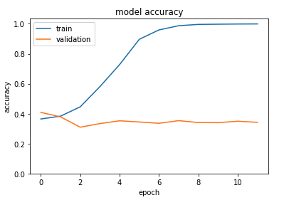
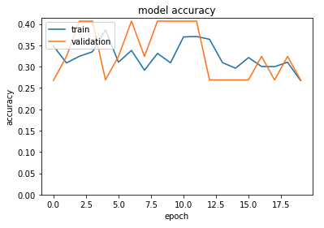

<<<<<<< HEAD
### Module objectives:
 - Convert non-tabular data sources into arrays as neural network inputs
 - Construct neural networks, tune hyperparameters, and evaluate NN models.
 - Apply transfer learning to neural networks

# Predict drug MoA from cell images
=======
### Module Objectives:
- Effectively leverage cloud resources to create and use remote servers for computing, storage, and application deployment.
- Build and deploy python web applications.

# metis-engineering

# Predict drug MoA from cell images pt.2

Trained a convolutional neural networks on images of HUVEC-1 cells treated with one of 434 immunological factor. Performed modeling with a cloud-based GPU to increase learning speed. In addition to changing layers, adjusted learning speed, batch size, and loss function. Created a streamlit app to engage citizen scientists. 

Figure 1: Representative graph of accuracy as a function of epoch for a model with overfitting issues.

Figure 2: Representative graph of accuracy as a function of epoch for a model that finds a local minima (predictions are all for one category). 

>>>>>>> cfbccb9 (update readme)

### Tools

 - Pandas, seaborn, matplotlib
<<<<<<< HEAD
 - Omero and IDR to connect to IDR, retrieve images and metadata
- Keras/Tensorflow for neural network training
- Scikit-learn for model evaluation 
- Tensorboard to visualize CNN experimentation

### Databases
 - Image data repository (IDR)
=======
 - Keras/Tensorflow
 - Google cloud storage
 - Google cloud platform
 - Google Colab
 - Streamlit, Heroku

### Databases
 - RxRx.ai (dataset RxRx2)
>>>>>>> cfbccb9 (update readme)
 - Uniprot