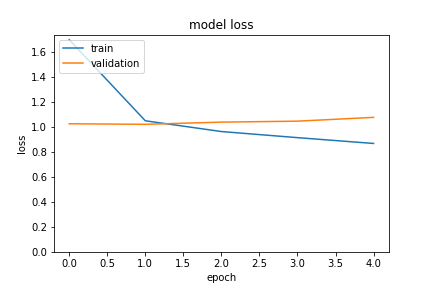

Emily Lorenzen

8/17/2021

Metis Bootcamp - Engineering

# Minimum Viable Project

Presented above is the train and validation loss at each deep learning epoch. The deep learning model was trained on a subset (~1/24th) of the available imaging data. In this model, I narrowed down the mechanism of action from 25 categories to four -  the three most represented mechanisms (growth factor, interleukin, and GPCR agonist) and other. Interestingly, the loss for the validation data was not decrease with each epoch. 