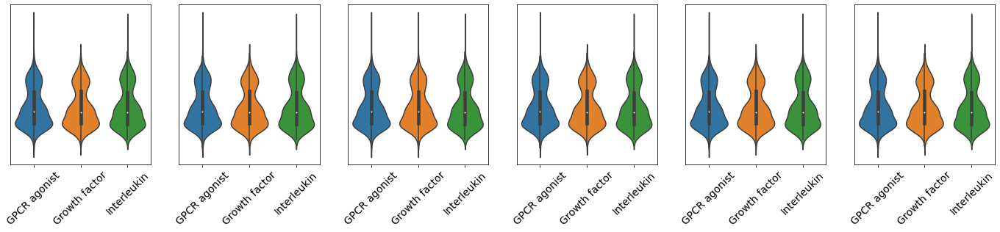

Emily Lorenzen

8/20/2021

Metis Bootcamp - Engineering

Final Writeup

# Towards the development of a deep learning model to predict mechanism of action from cellular images 

## Abstract
Ideally, pharmaceutical would drugs modify only the fucntionality of the protein(s) that affect particular signaling system(s) known to contribute to disease. In reality, drugs often show promiscuity, causing unwanted side effects and unexpected toxicity. Since most assays to determine mechanism of action (MoA can survey only one MoA at a time, drug promiscuity is often overlooked in preclinical trials, often leading to clinical trial failures. In this project, I attempted to train a deep learning model to predict mechanism of action. 

## Tools and Algorithms

### Data acquistion and EDA:
Data were obtained from Recursion via API, a biotech company specializing in creating large datasets to facilitate the application of AI in basic biomedical sciences. In total, ~800,000 images (1024 x 1024 pixels) were uploaded to google cloud storage. Of note, each image represents a single channel for a picture taken of cells. Following processing, each picture was represented by a (1024, 1024, 6) array. For each picture, the metadata indicates the immunological treatment used on the cells. 

The y-target was mechanism of action, so I created a new feature to indicate the mechanis of action of each immunoloigal treatment. I primarily used uniprot via the Biopython package to annotate mechanism of action. When necessary, I referred to pubmed and personal domain knowledge.

For EDA, I utilized sklearn, numpy, pandas and seaborn. 

### Cloud computing

Ultimately, I plan to train a model with ~ 140k complete images (consisting of 6 channel images corresponding to each fluorescent dye used) with the dimensions of (1024, 1024, 6) for each complete image. As an initial pass, and due to the time constraints of this project, I processed the complete images into an array of ((1/12th of the number of available images), 100, 100, 6). Despite the pixel redution, I could not use my local computer to process all the images.  I attempted to create a google cloud VM to accelerate the processing speed and memory capabilities but was unable to gain permission to use the computational power needed for the project timeline. 

I have uploaded all 140k completes images with dimension of (100, 100, 6) to a google cloud bucket (~50 Gb) for processing once permissions are granted. 

### Data modeling 

I initially planned to utilize the enhanced computing powers (in particular, using either GPU or TPU) of GCP to train a deep learning model via tensorflow and keras. Due to the need to acquire permissions prior to accessing an accelerator, I was unable to utilize GCP as desired. 

As an alternative, I created a virutal machine instance with the highest computing power allowed that did not require permissions (8 vCPU, 52 GB). I used Keras, TensorFlow, and sklearn to train and evaluate convulational neural networks with different hyperparameters.

### App deployment

Streamlit was used to create a deployable app. 

## Results

I adjusted many different parameters in an attempt to train a CNN on the training data, which consisted of ~20,000 images with unbalanced classes. My attempts included, using class weights to balance the classes, adjusting the CNN layers (including filters and intializer) dense layers (including nodes, activation algorithm and regularization), dropout layers, and batch number. I also explored using different loss functions, training speeds, and adjusting training speed as a function of loss changes. Despite these attempts, I was unable to obtain a model with satisfactory recall results.  

Therefore, I looked into basic features of the sample images to gain insight into how the images look different between mechanism of action. I first investigated the sum of the intesity of each channel for three different mechanisms of action and plotted histograms for each channel where all three MoAs are displayed in different colors. 

Similarly, I calculated the average intensity in each channel for three MoA's and plotted the distribution as a violin graph 

Finally, I created an app to engage citizen scientists and use human intelligence to help inform my further attempts at using artificial intelligence for this project. In the app, a user selects a mechanism of action and the app return the six channels compromising an image with that MoA and a negative control image for comparison. I then ask that the user report which channels they believe are the most different between the two treatment types. 

## Communication

Results were presented on August 20, 2021 to colleagues in the Metis data science bootcamp. Code is available is at https://www.github.com/emilylorenzen/metis-engineering. The streamlit app with be deployed using Heroku. 

